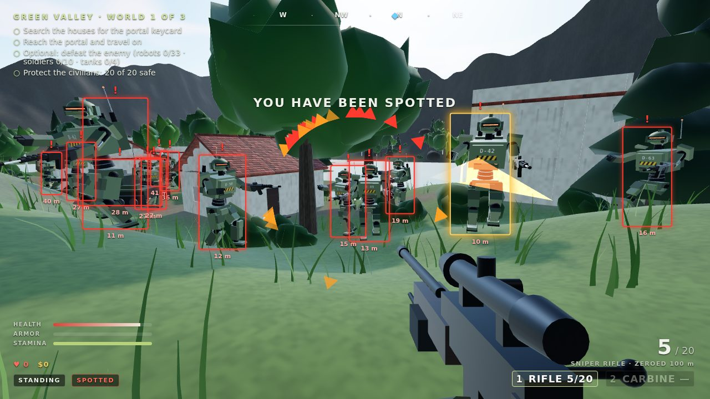

# Playing Zama Sniper with LLM agents

Zama Sniper: Open World is built to be played by language-model agents as well as people. An agent gets a text briefing of what the sniper can see, sends high-level commands (walk to a building, search a crate, aim at a robot, fire), and the world waits while it thinks.

There are three ways in:

| Way in | Use it when |
| --- | --- |
| [MCP server](#mcp-server) (`agent/mcp-server.mjs`) | You want Claude Code, Claude Desktop, or any MCP client to play. |
| [Example Claude agent](#example-claude-agent) (`agent/claude-agent.mjs`) | You want a ready-made agent loop on the Claude API to start from. |
| [In-page API](#in-page-api-windowzamasniper) (`window.zamaSniper`) | You are writing your own harness (Playwright, Puppeteer, a browser extension, a test). |



## How it works

- **Lockstep time.** The first command an agent sends switches the game to lockstep: the simulation only advances while commands run, 60 steps per game second. Between calls the world is frozen, so a slow model is never punished for thinking. `release()` hands control back to real time.
- **Observations, not pixels.** Each observation lists your status, the robots worth knowing about (distance, angle, whether they can see you, whether you have a clear shot), nearby doors, containers, and pickups, the nearest buildings with how many containers are still unsearched, the portal, what the crosshair is on, what `interact` would do right now, and an event log ("your shot hit r3 - destroyed", "r2 shot you for 12 damage from 8 m"). Screenshots are available too, for vision models.
- **High-level commands.** `go_to` plans a route around walls, through doorways, and up stairs, opens closed doors on the way, and stops early if a robot spots you or you are hit. `aim` raises the scope and aims at a robot's chest with bullet drop allowed for. `fire` waits for the round to land and reports what it hit.
- **Same game.** Agents use the same input actions a player's keys trigger; nothing is simulated differently.

Angles: a **bearing** is a compass direction in degrees (0 = north, 90 = east). A **relative** angle is measured from where the sniper is looking, positive to the right.

Ids in observations: `r#` robots, `d#` doors, `c#` containers, `p#` pickups, `b#` buildings, and `portal`.

## MCP server

`agent/mcp-server.mjs` is a [Model Context Protocol](https://modelcontextprotocol.io/) server over stdio with no dependencies beyond the ones the game already uses. It opens the game in headless Chromium (Playwright) and exposes five tools:

| Tool | What it does |
| --- | --- |
| `game_help` | The rules and the full command reference. |
| `game_start` | Starts a fresh run (optionally in world 0, 1, or 2) and returns the opening briefing. Also used to try again after dying. |
| `game_observe` | The current briefing (time does not pass). `{"json": true}` also returns the structured observation. |
| `game_act` | Runs up to 12 commands in order and returns what each did plus a fresh briefing. |
| `game_screenshot` | A PNG of what the sniper sees. |

Build the game once so the server can serve it locally (without a build it plays the [published game](https://codejq.github.io/zama-sniper/)):

```powershell
npm ci
npm run world:build
```

Add it to Claude Code:

```powershell
claude mcp add zama-sniper -- node /path/to/zama-sniper/world/agent/mcp-server.mjs
```

Or to Claude Desktop (`claude_desktop_config.json`), or any client that takes the same shape:

```json
{
  "mcpServers": {
    "zama-sniper": {
      "command": "node",
      "args": ["/path/to/zama-sniper/world/agent/mcp-server.mjs"]
    }
  }
}
```

Then ask: *"Use the zama-sniper tools to play the game. Read game_help first."*

Options: `--url <address>` plays a specific build (for example the dev server at `http://127.0.0.1:5173/`), and `--headed` shows the browser window so you can watch. Chromium is found through `CHROME_PATH`, then the usual install locations.

## Example Claude agent

`agent/claude-agent.mjs` is a complete agent loop on the Claude API using the official TypeScript SDK (`@anthropic-ai/sdk`), the same tools as the MCP server, and `claude-opus-5` with adaptive thinking. It clears old tool results as the game goes on so long runs stay within the context window, and it enables server-side refusal fallbacks.

```powershell
npm run world:build
$env:ANTHROPIC_API_KEY = "sk-ant-..."    # or sign in once with `ant auth login`
node world/agent/claude-agent.mjs --turns 40
```

Options: `--turns <n>` (default 40), `--world <0-2>`, `--url <address>`, `--headed`. Use `--dry-run` to exercise the whole tool path with a scripted stand-in and no API calls.

## Commands

`game_act` takes a list of these, run in order. Long ones (`go_to`, `wait`) stop early when a robot spots you or you take a hit, so the agent can react.

| Command | Effect |
| --- | --- |
| `{"do":"start","world":0}` | Start a fresh run (world optional). Use it again after dying. |
| `{"do":"go_to","target":"b3"}` / `{"do":"go_to","x":10,"z":-4}` | Walk to a thing or a point by a planned route; opens doors, climbs stairs, ducks under low lintels. `run`, `seconds` (default 30) optional. |
| `{"do":"move","direction":"forward","seconds":1}` | Walk (`forward`, `back`, `left`, `right`; max 5 s; `run` optional). |
| `{"do":"turn","degrees":30}` / `{"do":"look","degrees":-5}` | Turn right (negative = left) / tilt the view up (negative = down). |
| `{"do":"face","bearing":90}` / `{"do":"face","target":"c2"}` | Face a compass bearing or a thing. |
| `{"do":"aim","target":"r2"}` | Scope in and aim at a robot's chest, allowing for bullet drop. Warns if something is in the way. |
| `{"do":"fire"}` | Shoot and report what the round hit. Reloads automatically when the magazine is empty. |
| `{"do":"scope","on":true}` / `{"do":"zoom"}` | Raise or lower the scope / cycle magnification (4×, 8×, 12× with the scope upgrade). |
| `{"do":"stance","value":"prone"}` | `stand`, `crouch`, or `prone`. Crouching or crawling inside a bush makes you nearly invisible. |
| `{"do":"interact"}` | Open or close a door, pick up an item, or enter the portal. The observation's `prompt` says what it would do. |
| `{"do":"search","seconds":1.6}` | Hold interact to search the container in front of you. |
| `{"do":"jump"}` / `{"do":"reload"}` / `{"do":"wait","seconds":1}` | Jump, reload, or let time pass (max 10 s). |

## In-page API: `window.zamaSniper`

Every build of the game, including the published one, has this object:

```js
const game = window.zamaSniper;
game.version;        // 1
game.help;           // command reference text
game.observe();      // structured observation (drains the event log)
game.describe();     // the same as a short text briefing
game.act([           // run commands in lockstep; returns { results, observation, briefing }
  { do: 'start', world: 0 },
  { do: 'go_to', target: 'b1' },
]);
game.release();      // back to real time for a human player
```

A briefing looks like this:

```text
[PLAYING] Green Valley (world 1 of 3), t=0.2s
Objectives: [ ] Search containers in the houses for the portal keycard; [ ] Reach the portal and enter it; [ ] Optional: destroy the robots (0/7)
You: at (18.1, 122.4), facing 347° (pitch 0°), stand, visible. Health 100, armor 0, lives 0, cash $0.
Rifle: 5/5 in magazine, 20 spare.
Robots (relative angle: + right / - left):
  r5: 94 m at 26° (bearing 13°) - patrol, blocked from view
  r6: 110 m at -7° (bearing 340°) - patrol, blocked from view
Buildings: b7 101 m at 32° (4 unsearched); b8 139 m at -12° (2 unsearched)
Portal: 241 m at 14° (locked - find the keycard in a container).
```

The observation's TypeScript types are in [`src/agent/observation.ts`](src/agent/observation.ts), and the commands in [`src/agent/bridge.ts`](src/agent/bridge.ts).

## Tips for agent authors

- Search buildings nearest first; `go_to` a building's id (`b#`) walks to just outside its door. Inside, containers show up under *Nearby*, and ones on the other floor are marked `upstairs` or `downstairs`.
- Robots only hurt you within 10 m, but they radio your position to each other, take cover, and flank. Shoot from far away, and after every shot expect robots to come looking.
- Check `inSight` before shooting and heed `aim`'s "something is in the way" warning; move or change stance to get a clear line.
- A medkit or armor pickup you don't need yet stays where it is ("health full"), so you can come back for it.

## Checking it works

```powershell
npm run world:build
npm run world:agent-check   # MCP handshake and every tool against the built game, plus the example agent's dry run
```

CI runs this check on every change.
