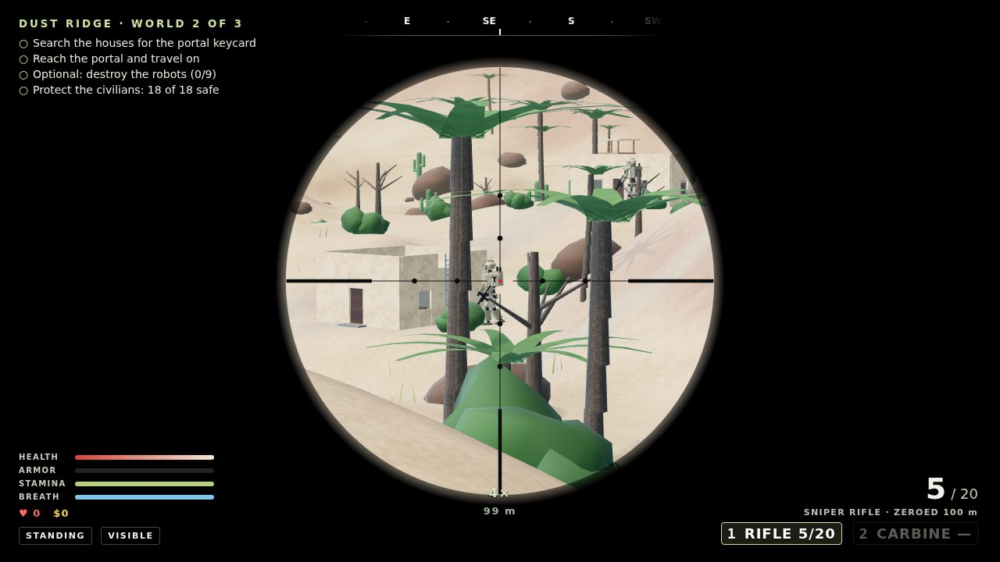
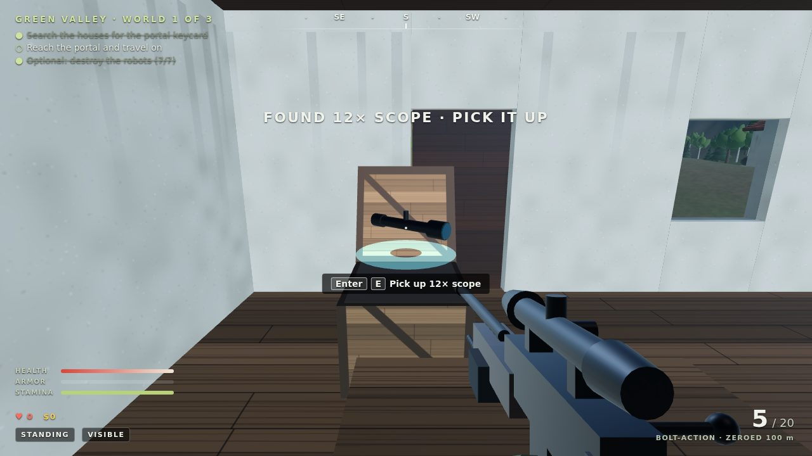
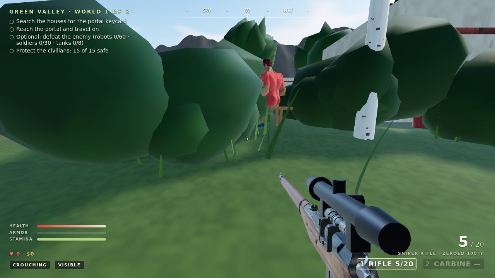
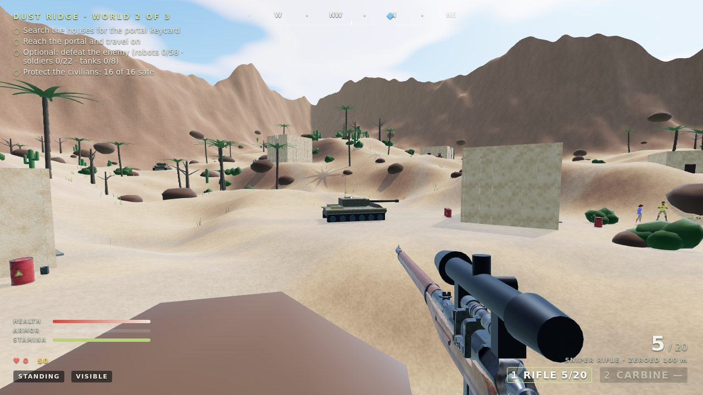
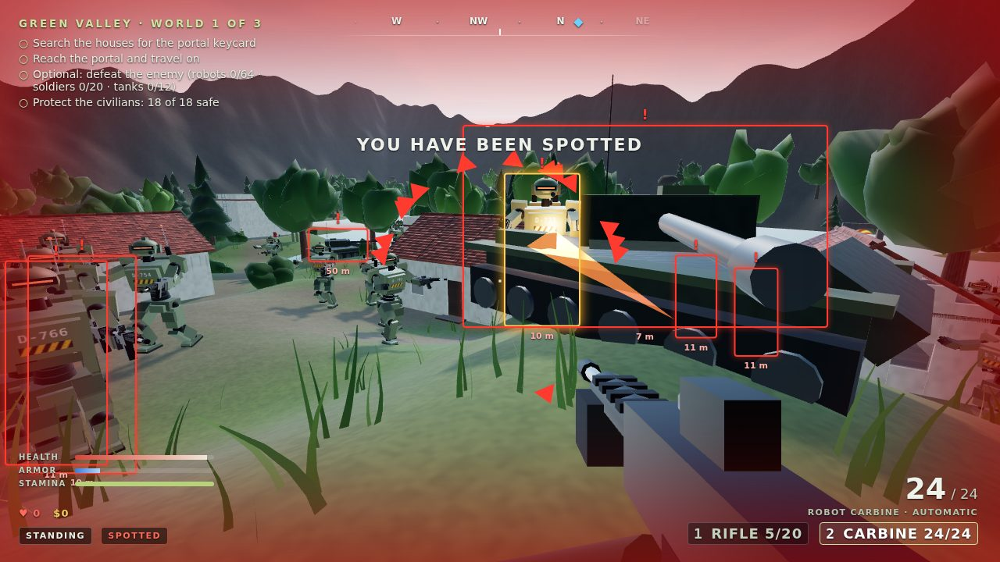
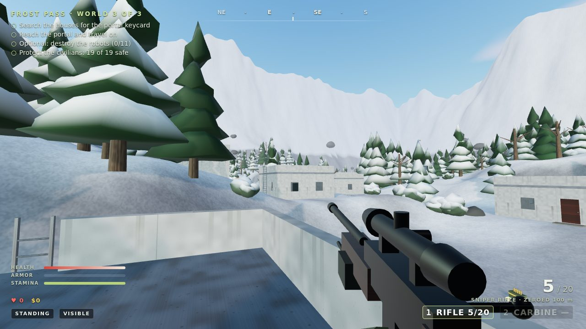
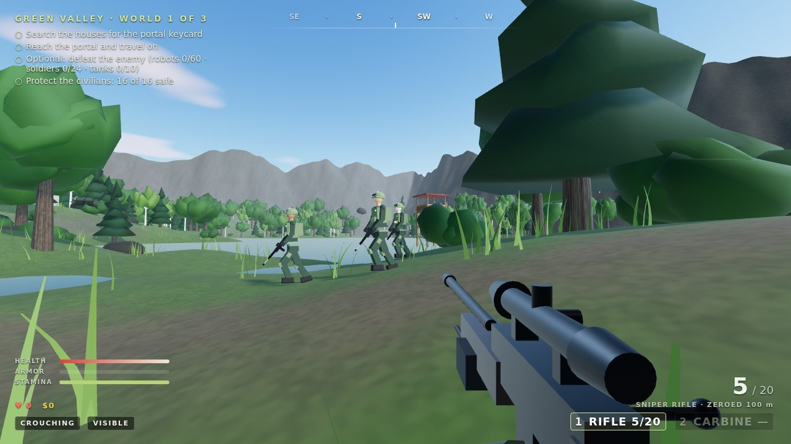

# Zama Sniper: Open World

A realistic first-person sniper game in the browser, built with [Three.js](https://threejs.org/), TypeScript, and Vite. Armed robot sentries have taken three worlds. Move quietly, hide, search buildings for each world's portal keycard, and pick your shots.

**[Play it in your browser](https://codejq.github.io/zama-sniper/)** · LLM agents can play too: see [AGENTS.md](AGENTS.md).


| | |
| --- | --- |
|  |  |
|  |  |
|  |  |
|  | |

## Play

```powershell
npm ci
npm run world:dev      # development server with debug hooks
npm run world:build    # production build in world/dist
```

The main layout uses the right hand around the arrow keys, like the classic maze game. The WASD and mouse layout works at the same time.

| Arrow-key layout | WASD and mouse | Action |
| --- | --- | --- |
| ↑ / ↓ | W / S | Move forward or back |
| ← / → | Mouse | Turn |
| Page Up / Page Down (or Insert / Delete) | Mouse | Look up or down |
| Home / End | A / D | Step left or right |
| Ctrl | Left click | Fire (hold for automatic fire with the carbine) |
| 1 / 2 or Q | 1 / 2, Q, or wheel | Sniper rifle / robot carbine |
| Right Shift (tap) | Right mouse (hold) | Scope (iron sights with the carbine) |
| + / − | Wheel | Switch between 4× and 8× (and 12× with the scope upgrade) |
| Enter | E | Open or close doors; hold to search; enter the portal |
| Backspace | R | Reload |
| Shift + ↑ | Shift + W | Sprint (either Shift); hold breath to steady the scope when aiming |
| C / Z | C / Z | Crouch / crawl (prone) |
| Space | Space | Jump; climb onto crates, walls, and ledges up to about 2 m |
| ↑ at a ladder | W at a ladder | Climb onto roofs and watchtowers |
| Enter (menu) | Click | Start, resume, or retry; Esc pauses |

Most browsers close the tab on Ctrl + W, so if you move with W, fire with the mouse.

## The worlds

- **Green Valley**: a farming village among oak, birch, and pine forests, with a lake and wooden watchtowers.
- **Dust Ridge**: an adobe desert outpost among dunes, rocks, palms, and cacti.
- **Frost Pass**: concrete bunkers in a snowy mountain pass with snow-covered pines and dense fog.

Each world is generated deterministically from its seed: heightfield terrain with flattened building plots and dirt roads, enterable one- and two-storey buildings (doors that swing open, windows, stairs, flat roofs reachable by ladder, and furniture), forests, bushes, rocks, and wind-blown grass. One searchable container in the building farthest from your spawn holds the keycard that unlocks the portal to the next world.

## How it plays

- **A big enemy force, different every run**: each world deploys its robots plus 20 to 30 more, 10 to 15 human soldiers, and four to six tanks. Where they start and the beats they walk (round houses, along the roads, across open ground) are drawn fresh every time you play; nobody starts within about 50 m of you, and one robot always guards the portal.
- **Human soldiers**: life-size troops in camouflage fatigues, helmets, and plate carriers, patrolling in squads of two or three. They move about 60% faster than the robots and fire more often, but like the robots they only hurt you within 10 m and one rifle hit drops them. They are smaller targets, and a fallen soldier drops a carbine too.
- **Replay a run**: add `?seed=anything` to the address to get the same enemies, families, and loot every time (handy for sharing a run or practising); without it every run is different.
- **Tanks**: one tank patrols the road to the portal, one circles the village, and the rest roam loops across open country, somewhere new each run. Once a tank sees you its turret swings round and, from 35 m or closer, it fires shells that burst with splash damage; trees and walls stop them. Four rifle hits (or a long burst of carbine fire) destroy a tank, which burns and smokes.
- **Civilians and their dogs**: families live in every world. Some picnic at a table beside their house, eating and chatting; others stroll, play, or stand waving. They are unarmed and never attack. Gunfire, explosions, and hunting robots panic them: braver ones run for the nearest cover and hide, others freeze and cower with their hands over their heads, and after a while they creep home and carry on. Robots that aren't busy with you sometimes pick on a civilian and shoot them. Shooting an innocent yourself (person or dog) costs 5% of your health; the objectives count how many are still safe.
- **The robot carbine**: a destroyed robot drops its carbine beside it. Walk up to it to take the gun, its armor plates (+25 armor), and 48 rounds; later carbines give more rounds and armor. It fires automatically while you hold the trigger, with iron sights instead of a scope: deadly close up, loose at range. Switch with 1, 2, or Q.
- **Robot squads**: once a robot spots you it radios your position to every robot within 60 m, and they converge. Assault robots bound forward from cover to cover (tree trunks, rocks, walls), pausing hunkered down in each; flankers swing wide round to your side and close in from there. Up close they strafe while they shoot. A shot that passes near a robot makes it dive for the nearest cover, and robots keep hunting for several seconds after losing sight of you.
- **Stealth**: robot sentries see you based on stance, movement, distance, and cover. Crouching or crawling inside a bush makes you nearly invisible. Their eyes turn cyan (patrolling), amber (suspicious or searching), and red (alert). Threat arrows around the reticle show robots that are noticing you.
- **Cover**: robots check your head, chest, shoulders, and hips separately. A tree trunk, wall, or rock hides whatever it covers, and each layer of leaves thins what they can see. Their rounds are traced through the world, so a trunk between you and a robot stops the bullet (you'll see it splinter the bark).
- **Close-quarters robots**: robot rifles only hurt within 10 m; tanks reach out to 35 m. A robot that spots you from farther away walks in to close the distance, so keep them at range and pick them off.
- **Clear view**: while you move, the objectives, compass, vitals, and ammo fade away so nothing blocks the view; they come back after a moment standing still. Danger warnings always stay, and your health stays up while you're hurt.
- **Who's shooting**: every incoming round leaves a glowing tracer and a muzzle flash, a red (hit) or amber (near miss) arrow at the edge of the screen points at the shooter, and robots firing at you are boxed in red with their distance.
- **Loot**: hold Enter/E on a crate, cabinet, desk, or locker to search it. The lid or door swings open and the find floats out, glowing in its colour; press Enter/E on it (or walk into it) to pick it up. Doors hide loot on the floor behind them more often than not. More finds lie loose around each world: on house floors (upstairs too), at the foot of trees and rocks, hidden in bushes, and by the roads. Everything is reshuffled every time you play, so the finds and their places are different each run; a box sometimes holds two things. A medkit or armor you don't need yet stays where it is until you do. Finds are cash, ammo boxes, body armor (soaks up part of each hit), medkits (only when you're hurt), extra lives (get back up instead of dying), and weapon upgrades: an extended magazine (up to 10 rounds), a suppressor (robots hear your shots from much closer, shown on the rifle), and a 12× scope (a third zoom step).
- **Sound**: every shot is loud. Robots within 75 m hear it and move to search the area it came from, so relocate after you fire.
- **Ballistics**: bullets fly at 820 m/s with gravity, zeroed at 100 m. Aim higher for long shots; the scope shows the range. A single hit anywhere on a robot destroys it.
- **Scope**: sway grows with standing, moving, and fatigue. It shrinks when you crouch or go prone, or when you hold your breath.
- **Survival**: after a full minute without being hurt, health comes back at 4 points a second, all the way to full. Medkits and extra rounds still turn up when you search.
- **Resupply**: a weapon never stays empty. While the rifle holds fewer than 10 rounds in all, it gets one back every 4 seconds; a carbine under 24 rounds gets one every 0.8 seconds. An empty magazine reloads by itself as soon as there is a round to load, and the HUD shows LOW AMMO · RESUPPLYING while it happens.

## Architecture

- `src/core`: seeded random numbers, noise, keyboard and mouse input, the collision world (axis-aligned boxes over a heightfield, with ladder, cover, and portal volumes plus raycasts), and procedural Web Audio.
- `src/world`: themes, terrain, building and watchtower generators, layout, procedural canvas textures, vegetation with wind shaders, and the scene builder. The scene builder merges static geometry per material and splits forests and grass into instanced tiles that hide with distance and cast shadows only when near.
- `src/player`: character physics (stances, stamina, jumping, ladders, climbing onto ledges), rifle state, ballistics, and the first-person rifle model. The rifle renders in its own scene with a narrower lens.
- `src/population`: civilians and dogs (calm routines, panic, hiding), family and picnic placement, their meshes and animations, and the population manager that also runs tanks, shells, and explosions.
- `src/weapons`: the robot carbine's state and first-person model.
- `src/enemies`: tank AI and model; random deployment of robots and soldiers; sentry AI for both kinds (patrol, suspicious, alert, search; cover-aware sight and ballistics; squad radio, bounding between cover, flanking, suppression), hit testing, the military robot model (hydraulic joints, sensor head, carbine) and the human soldier model on the same skeleton, with stride, combat crouch, head tracking, recoil, and collapse animations.
- `src/agent` and `agent/`: the LLM agent interface: observations and aim solving, the command bridge and route finding (stairs and doorways included), the in-page `window.zamaSniper` API, the MCP server, and an example Claude agent. See [AGENTS.md](AGENTS.md).
- `src/game.ts`: the frame loop, rendering (physical sky, image-based lighting, sun shadows that follow the player, ACES tone mapping, and dimmer light indoors), interaction, the HUD, and world-to-world travel.

## Testing

```powershell
npm run world:lint     # TypeScript
npm run world:test     # unit tests: movement, collision, layout, AI, ballistics, rifle
npm run world:smoke    # browser run: snipe, take fire, arrow keys and Ctrl, open a door, search, cross all portals
npm run world:agent-check   # after a build: the MCP server and every agent tool, plus the example agent's dry run
```

The smoke test drives the real game through development-only hooks (`window.zamaSniperWorld`), which production builds do not include. `node world/scripts/screenshots.mjs` regenerates the screenshots in `docs/screenshots`.
